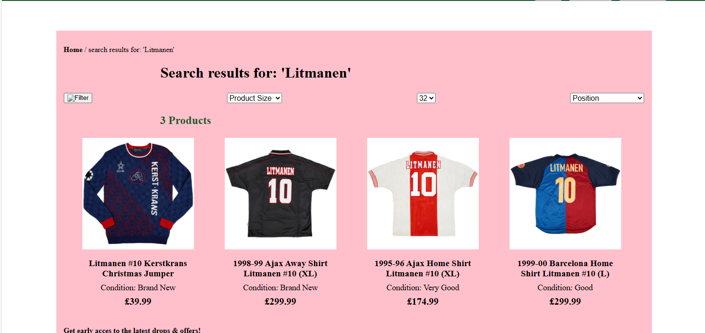

# Procesverslag
Markdown is een simpele manier om HTML te schrijven.  
Markdown cheat cheet: [Hulp bij het schrijven van Markdown](https://github.com/adam-p/markdown-here/wiki/Markdown-Cheatsheet).

Nb. De standaardstructuur en de spartaanse opmaak van de README.md zijn helemaal prima. Het gaat om de inhoud van je procesverslag. Besteedt de tijd voor pracht en praal aan je website.

Nb. Door *open* toe te voegen aan een *details* element kun je deze standaard open zetten. Fijn om dat steeds voor de relevante stuk(ken) te doen.

## Jij

  
uitwerken voor kick-off werkgroep

  ### Auteur:
  Jaron van Ommen

  #### Je startniveau:
  Blauw

  #### Je focus:
  hier je focus (kies uit responsive óf surface plane)
 

classicfootballshirts.com

  
uitwerken voor kick-off werkgroep

  ### Je opdracht:
  (https://www.classicfootballshirts.co.uk/)
  Hier ga ik de specifieke zoekpagina naar Litmanen shirts maken en 1 specifieke pagina van 1 shirt.

  #### Screenshot(s) van de eerste pagina (small screen): 
  hier de naam van de pagina  
  

  #### Screenshot(s) van de tweede pagina (small screen):
  hier de naam van de pagina  
  
 

## Toegankelijkheidstest 1/2 (week 1)

  
uitwerken na test in 2e werkgroep

  ### Bevindingen
  Lijst met je bevindingen die in de test naar voren kwamen:
  Toegankelijkheid van de website is goed voor mensen die: niet goed kunnen lezen of zien. Door het gebruik van spraak leest de computer voor welke pagina de gebruiker op is en wat er in beeld komt.
  Bij de ruimte tussen shirts op de zoekpagina zit iets te weinig ruimte om het duidelijk te maken.
  Een aantal img's hebben geen alt attribute.
  Ook gebruikt de website geen h1 element.
  Ook maakt de website niet gebruikt van video en audio, al is het gebruik voor slechtziende goed te doen.
  Sommige van de links zijn niet recognisable als links.
  De color contract bij de website is zo goed als altijd goed volgens AA. Bij een aantal text die overlapt bij images wordt de contrast niet goed volgens AA maar dit heb ik maar 1 keer kunnen vinden, bij een scherm waar ik niet aan ga werken.
  

## Breakdownschets (week 1)

  
uitwerken na afloop 3e werkgroep

  ### de hele pagina: 
  

  ### dynamisch deel (bijv menu): 
  

  ### wellicht nog een dynamisch deel (bijv filter): 
  

## Voortgang 1 (week 2)

  
uitwerken voor 1e voortgang

  ### Stand van zaken
  hier dit ging goed & dit was lastig (neem ook screenshots op van delen van je website en code)

  ### Agenda voor meeting
  samen met je groepje opstellen

  | Jaron          | student 2          | student 3    | student 4        |
  | ---            | ---                | ---          | ---              |
  | HTML           | en dit             | en ik dit    | en dan ik dat    |
  | bespreken      | dit als er tijd is | nog een punt | dit wil ik zeker |
  | ...            | ...                | ...          | ...              |

  ### Verslag van meeting
  Een aantal punten van mijn HTML moeten verbeterd worden. Door bijvoorbeeld de div's weg te werken.

## Voortgang 2 (week 3)

  
uitwerken voor 2e voortgang

  ### Stand van zaken
  hier dit ging goed & dit was lastig (neem ook screenshots op van delen van je website en code)

  ### Agenda voor meeting
  samen met je groepje opstellen

  | Jaron          | student 2          | student 3    | student 4        |
  | ---            | ---                | ---          | ---              |
  |                | en dit             | en ik dit    | en dan ik dat    |
  |                | dit als er tijd is | nog een punt | dit wil ik zeker |
  | ...            | ...                | ...          | ...              |

  ### Verslag van meeting
Verbeter punten: 
Bekijk nog even je HTML structuur er zitten nog wat verbeteringen, bedenk wel dat er altijd een h1 op elke pagina moet zijn deze kun je ook eventueel hidden maar zorg wel dat die er is. Gebruik voor uitklapbare elementen het 
 element dit is semantisch gezien het beste (https://developer.mozilla.org/en-US/docs/Web/HTML/Element/details).  Check ook of je nog bepaalde kleuren of margins in custom properties kan zetten. Zet geen position styling op headings. Voor het weghalen van de rondjes bij radio buttons (https://codepen.io/jacobberglund/pen/mdPEza). Goed bezig over het algemeen !

## Toegankelijkheidstest 2/2 (week 4)

  
uitwerken na test in 9e werkgroep

  ### Bevindingen
  Lijst met je bevindingen die in de test naar voren kwamen (geef ook aan wat er verbeterd is):
  
  

## Voortgang 3 (week 4)

  
uitwerken voor 3e voortgang

  ### Stand van zaken
  hier dit ging goed & dit was lastig (neem ook screenshots op van delen van je website en code)

  

  ### Agenda voor meeting
  samen met je groepje opstellen

  | Jaron          | student 2          | student 3    | student 4        |
  | ---            | ---                | ---          | ---              |
  | CSS en HTML    | en dit             | en ik dit    | en dan ik dat    |
  |                | dit als er tijd is | nog een punt | dit wil ik zeker |
  | ...            | ...                | ...          | ...              |

  ### Verslag van meeting
  De H1 en H2 van de index neer binnen schuiven moet gedaan worden, en de second pagina in een grid gezet doordat deze sections naast elkaar moeten staan.

## Eindgesprek (week 5)

  
uitwerken voor eindgesprek

  ### Je uitkomst - karakteristiek screenshots:
  

  ### Dit ging goed/Heb ik geleerd: 
  Korte omschrijving met plaatjes

  

  ### Dit was lastig/Is niet gelukt:
  Korte omschrijving met plaatjes

  

## Bronnenlijst

  
continu bijhouden terwijl je werkt

  Nb. Wees specifiek ('css-tricks' als bron is bijv. niet specifiek genoeg). 
  Nb. ChatGpT en andere AI horen er ook bij.
  Nb. Vermeld de bronnen ook in je code.

  1. bron 1
  2. bron 2
  3. ...

